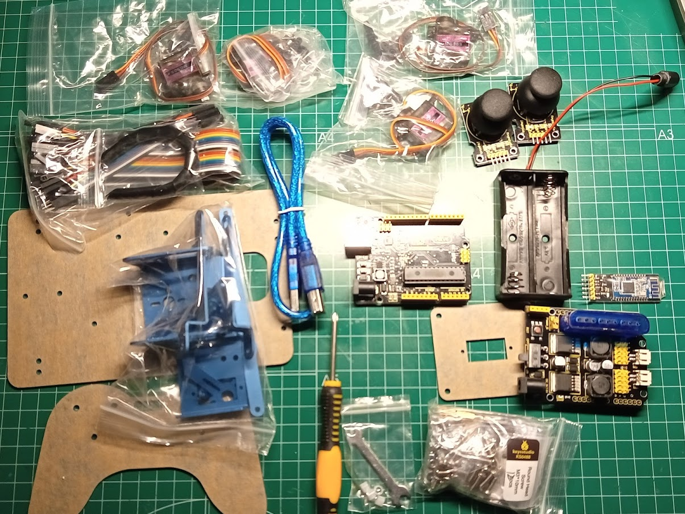

# Testing a 4 DOF robotic arm

This is a 4 DOF robotic arm from Keyesudio

[Product](https://es.aliexpress.com/item/32960656995.html)

It' power by 2 x 18650 batteries (not include in the kit)

* An arduino clone board
* Shield with:
    * 12 servo like connectors
    * PS2 Joystick connector (PS2 Joystick not included)
* HM-10 Bluetooth module
* 4 x servo 9g with metal gears
* Arm metalic structure
* 2 x analog joystick controller

## Pinout

Name|IO Pin
---|---
Servo 1 (baseplate)|	A1
Servo 2 (left side)|	A0
Servo 3（right side）|	8
Servo 4（clamp claw）|	9
Right Joystick X|	A2
Right Joystick Y|	A5
Right Joystick Z (key)|	7
Left Joystick X|	A3
Left Joystick Y|	A4
Left Joystick Z (key)|	6
D1/DAT of PS2|	12
D0/CMD of PS2|	10
CE/SEL of PS2|	11
CLK of PS2|	13

## Servo movements

Name|	0°|	180°
---|---|---
Servo 1（baseplate）|	Rotate toward the rightmost|	Rotate toward the leftmost
Servo 2（right side）|	Rocker arm connected to Servo 2 stretches out|	draw back
Servo 3（left side）|	Rocker arm connected to Servo 3 draws back|	stretches out
|Servo 4（clamp claw）|	closed|	opened

## Electric connections

You can control the arm using:
* 2 x analog joysticks
* ps2 joystick
* [app](https://play.google.com/store/apps/details?id=com.keyestudio.keyes_arm_123) via bluetooth

## Code

[Test: control arm with analog joysticks](./codigo/test_arm_joystick.ino)

## Pictures

[Wiki of keyestudio](https://wiki.keyestudio.com/KS0488_Keyestudio_4DOF_Robot_Arm_DIY_Kit_V2.0_for_Arduino)